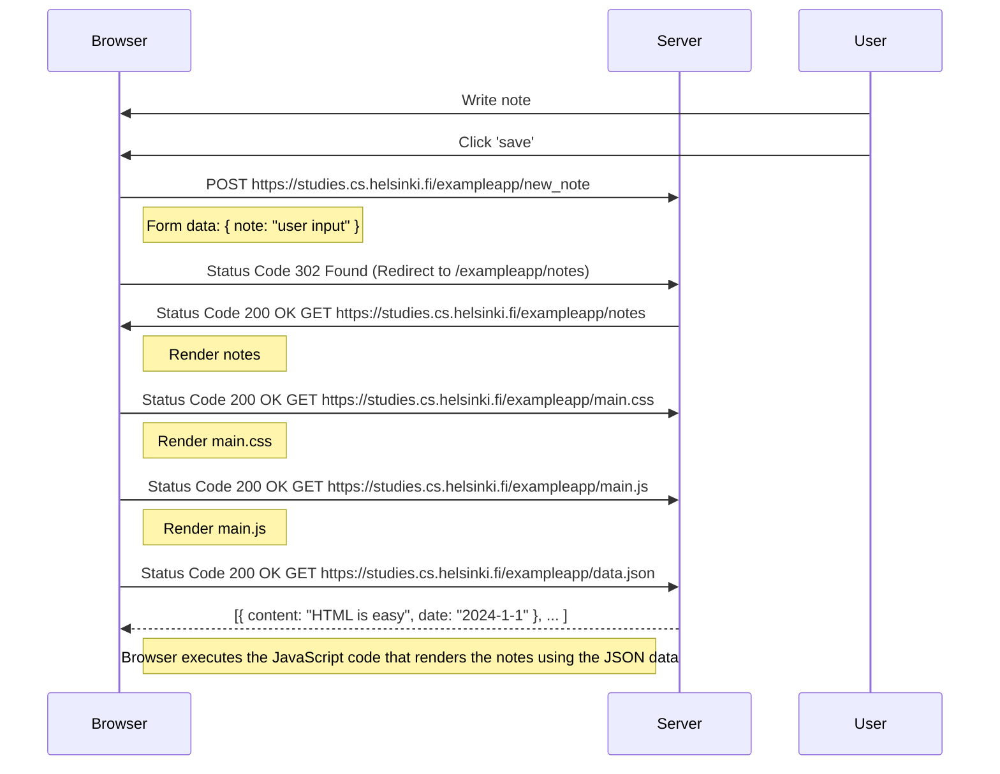

# Diagrama de secuencia de notas

```mermaid
sequenceDiagram
    participant Browser
    participant Server
    participant User

    User->>Browser: Write note
    User->>Browser: Click 'save'
    Browser->>Server: POST https://studies.cs.helsinki.fi/exampleapp/new_note
    Note right of Browser: Form data: { note: "user input" }

    Browser->>Server: Status Code 302 Found (Redirect to /exampleapp/notes)
    Server->>Browser: Status Code 200 OK GET https://studies.cs.helsinki.fi/exampleapp/notes
    Note right of Browser: Render notes

    Browser->>Server: Status Code 200 OK GET https://studies.cs.helsinki.fi/exampleapp/main.css
    Note right of Browser: Render main.css

    Browser->>Server: Status Code 200 OK GET https://studies.cs.helsinki.fi/exampleapp/main.js
    Note right of Browser: Render main.js

    Browser->>Server: Status Code 200 OK GET https://studies.cs.helsinki.fi/exampleapp/data.json
    Server-->>Browser: [{ content: "HTML is easy", date: "2024-1-1" }, ... ]

    Note right of Browser: Browser executes the JavaScript code that renders the notes using the JSON data
```
