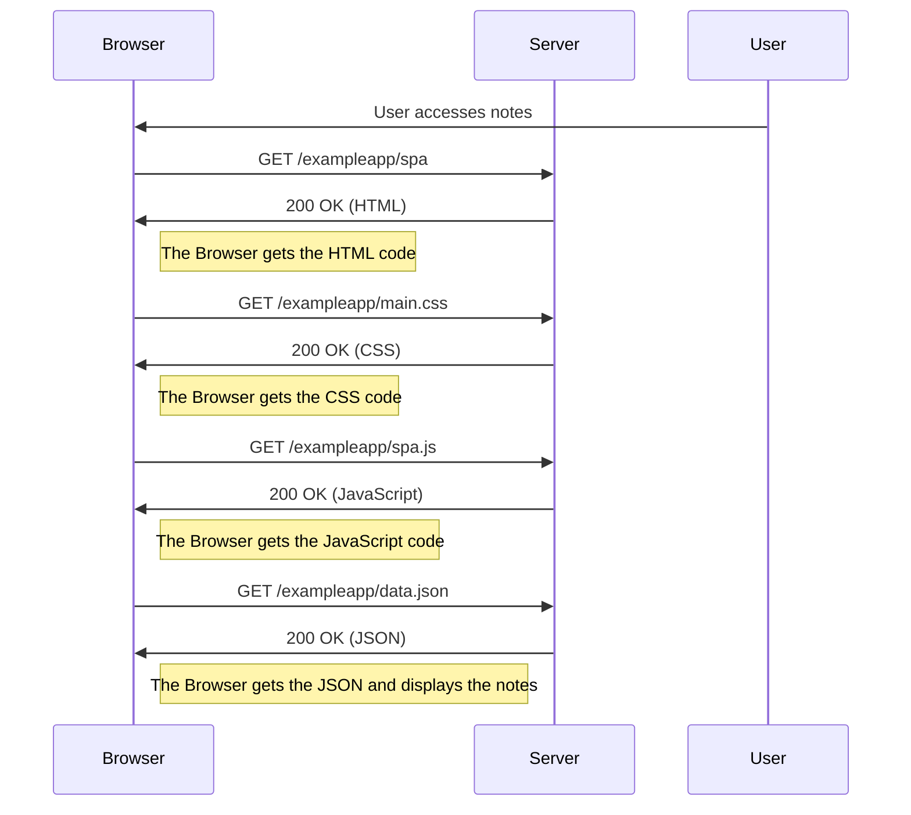

# Diagrama de secuencia pagina notas (SPA)

```mermaid
sequenceDiagram

    participant Browser
    participant Server
    participant User

    User->>Browser: User accesses notes

    Browser->>Server: GET /exampleapp/spa
    Server->>Browser: 200 OK (HTML)
    Note right of Browser: The Browser gets the HTML code

    Browser->>Server: GET /exampleapp/main.css
    Server->>Browser: 200 OK (CSS)
    Note right of Browser: The Browser gets the CSS code

    Browser->>Server: GET /exampleapp/spa.js
    Server->>Browser: 200 OK (JavaScript)
    Note right of Browser: The Browser gets the JavaScript code

    Browser->>Server: GET /exampleapp/data.json
    Server->>Browser: 200 OK (JSON)
    Note right of Browser: The Browser gets the JSON and displays the notes

```
